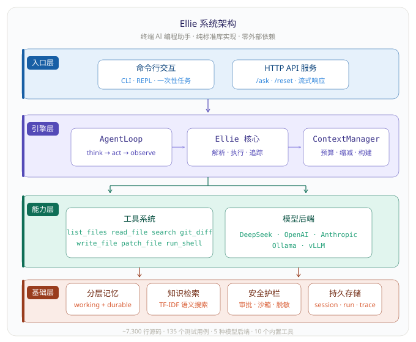
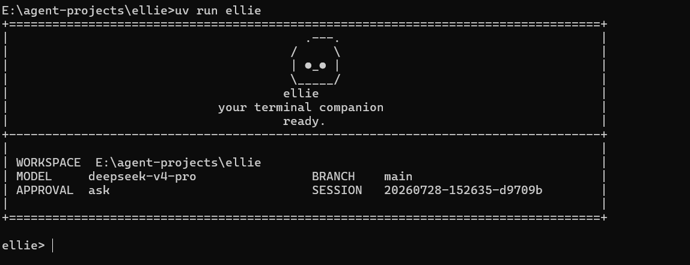

# ellie

`ellie` 是一个在终端里跑的轻量 coding agent。给它一个任务，它会自己读代码、搜文件、改代码、跑命令，每一步都留记录。

她不是一个聊天窗口，更像一个坐在你终端里的编程搭档——理解你的仓库，记住上下文，把事情做完。

## 适合做什么

- 在本地仓库排查测试失败，定位根因
- 读取项目结构，给出修改方案
- 基于现有代码小步迭代，而不是脱离仓库空想
- 会话持久化，支持 `/resume` 恢复上次中断的工作

## 主要特性

- 包名 `ellie`，CLI 命令 `ellie`，模块入口 `python -m ellie`
- 会话保存在 `.ellie/sessions/`，运行工件保存在 `.ellie/runs/<run_id>/`
- 支持五类模型后端：DeepSeek、OpenAI、Anthropic、Ollama、vLLM
- 8 个内置工具：list_files、read_file、search、run_shell、write_file、patch_file、git_diff、delegate
- 分层记忆系统：working memory（临时笔记 + 文件摘要）+ durable memory（项目约定、决策、偏好）
- 上下文预算管理：自动按 prefix/memory/history/request 分区，超预算时触发缩减
- 安全沙箱：所有文件操作锚定在 workspace root 下，敏感信息自动脱敏
- 审批模式：`ask` / `auto` / `never` 三级控制高风险操作
- 零外部依赖，纯标准库实现

## 截图

### 架构概览



### 终端交互




## 安装

需要 Python 3.10+。

```bash
# 推荐：用 uv
uv sync

# 或者 pip 可编辑模式
pip install -e .
```

## 快速开始

```bash
# 在当前仓库启动交互模式
uv run ellie

# 指定工作目录
uv run ellie --cwd /path/to/another/repo

# 一次性任务
uv run ellie "帮我排查测试失败的原因"

# 恢复上次会话
uv run ellie --resume latest
```

## 模型后端

ellie 启动时读取项目根目录的 `.env`。配置优先级：

```
显式 CLI 参数 > .env 里的 ELLIE_* 变量 > 旧环境变量 > 代码默认值
```

Provider 选择：

```
--provider > ELLIE_PROVIDER > 默认 deepseek
```

### 推荐配置：DeepSeek

最小配置只需 key：

```bash
ELLIE_DEEPSEEK_API_KEY="your-api-key"
```

默认模型和接口：

```bash
ELLIE_DEEPSEEK_API_BASE="https://api.deepseek.com/anthropic"
ELLIE_DEEPSEEK_MODEL="deepseek-v4-pro"
```

### 可选：OpenAI / Anthropic

```bash
# OpenAI-compatible
uv run ellie --provider openai

# Anthropic-compatible
uv run ellie --provider anthropic
```

### 可选：本地 Ollama

```bash
ollama serve
ollama pull qwen3.5:4b
uv run ellie --provider ollama --model qwen3.5:4b
```

### 可选：vLLM

```bash
uv run ellie --provider vllm
```

## 工具列表

| 工具 | 说明 | 风险 |
|---|---|---|
| `list_files` | 列出工作区文件 | 低 |
| `read_file` | 按行号读取文件 | 低 |
| `search` | 用 rg 或简单回退搜索代码 | 低 |
| `git_diff` | 查看 git 工作区变更 | 低 |
| `run_shell` | 在仓库根目录执行 shell 命令 | 高 |
| `write_file` | 写入文本文件 | 高 |
| `patch_file` | 精确替换文件中的一个文本块 | 高 |
| `delegate` | 启动只读子 agent 做调查 | 低 |

## 常用交互命令

- `/help` — 查看内置命令
- `/memory` — 查看提炼后的工作记忆
- `/session` — 查看当前会话文件路径
- `/reset` — 清空当前会话状态
- `/exit` / `/quit` — 退出

## 安全

`ellie` 不会默认放行所有操作。高风险操作受审批模式控制：

- `--approval ask` — 每次高风险操作前询问（默认）
- `--approval auto` — 自动放行
- `--approval never` — 拒绝所有高风险操作

每次运行后，`.ellie/runs/<run_id>/` 下会写出：

- `task_state.json` — 任务状态和步骤记录
- `trace.jsonl` — 逐事件执行时间线
- `report.json` — 最终运行摘要和指标

## 开发

```bash
uv run pytest tests -q
uv run ruff check ellie tests scripts
```

代码按边界拆分：`ellie/evaluation/` 放 benchmark 和 metrics，`ellie/providers/` 放模型后端适配，`ellie/features/` 放可选运行时能力。
